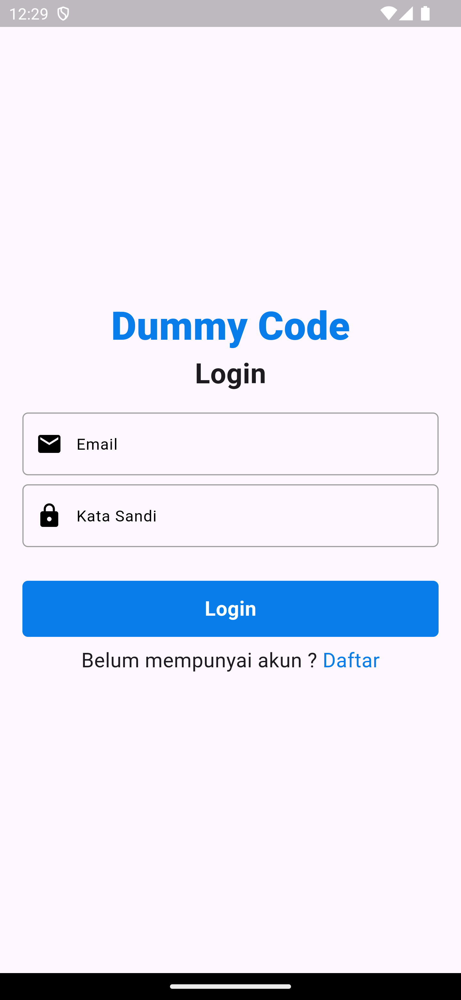
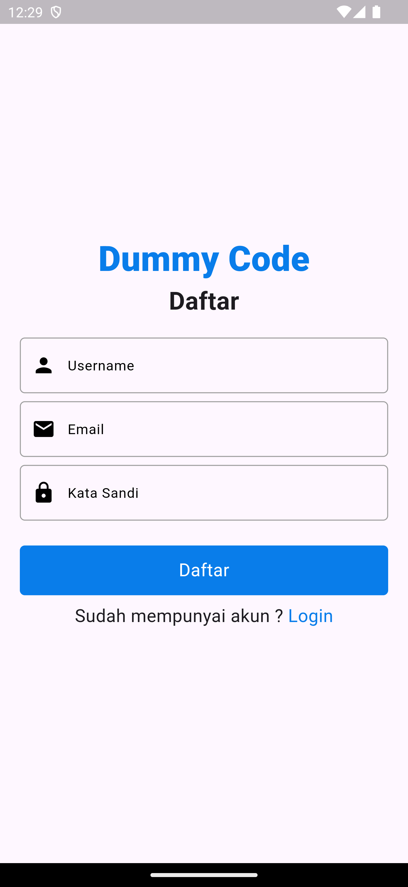
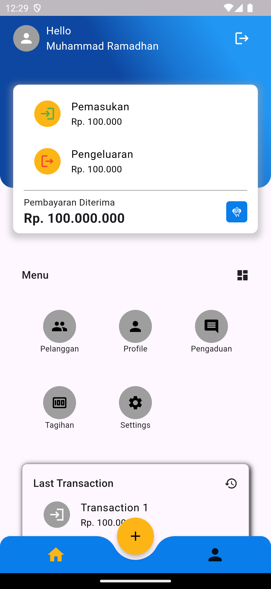

# MyFirebase 🚀  

A Flutter project demonstrating Firebase integration with **Riverpod** state management. It features authentication, Firestore database, responsive UI, and follows a clean architecture approach.


---

## ✨ Features

- ✅ **Firebase Authentication** (Email & Password)
- ✅ **Cloud Firestore** Integration
- ✅ **Riverpod** State Management
- ✅ **Responsive Layout** with `Sizer`
- ✅ **Animated Bottom Navigation**
- ✅ **Clean Architecture Structure**

---

## 📱 Screenshots

| Login Screen | SignUp Screen | Profile Screen |
|--------------|-------------|----------------|
|  |  |  |

> _Make sure to replace the above image paths with your actual asset paths._

---

## 🛠 Tech Stack

- **Flutter**: ^3.24.5
- **State Management**: `riverpod: ^2.6.1`
- **Firebase Packages**:
  - `firebase_core: ^3.10.1`
  - `firebase_auth: ^5.4.1`
  - `cloud_firestore: ^5.6.2`
- **UI Enhancements**:
  - `sizer: ^3.0.5` – Responsive design
  - `animated_bottom_navigation_bar: ^1.3.3` 

---

## 📁Project Structure
<pre> ``` lib/ ├── models/ # Data models │ └── user_firestore.dart # User data model │ ├── provider/ # State management │ ├── auth_provider.dart # Authentication state │ └── profile_provider.dart # Profile state │ ├── screens/ # UI Screens │ ├── auth/ # Auth flows │ │ ├── login/ # Login screen │ │ └── signup/ # Signup screen │ │ │ └── home/ # Main app │ ├── dashboard_screen.dart │ └── home_screen.dart │ ├── utils/ # Utilities │ ├── constants.dart # App constants │ └── widgets/ # Reusable components │ ├── firebase_options.dart # Firebase config └── main.dart # App entry point ``` </pre>

---


Made with ❤️ by Muhammad Ramadhan